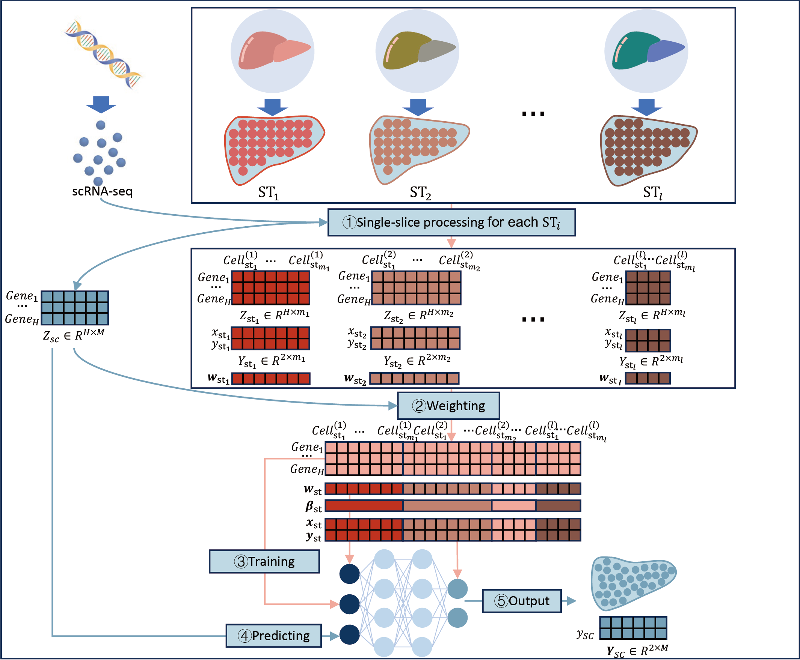

# iSORT
iSORT : an Integrative Method for Reconstructing Spatial Organization of Cells via Transfer Learning

## iSORT : an Integrative Method for Reconstructing Spatial Organization of Cells via Transfer Learning
iSORT 

# Pipeline for single-slice case

# Pipeline for multi-slice case

