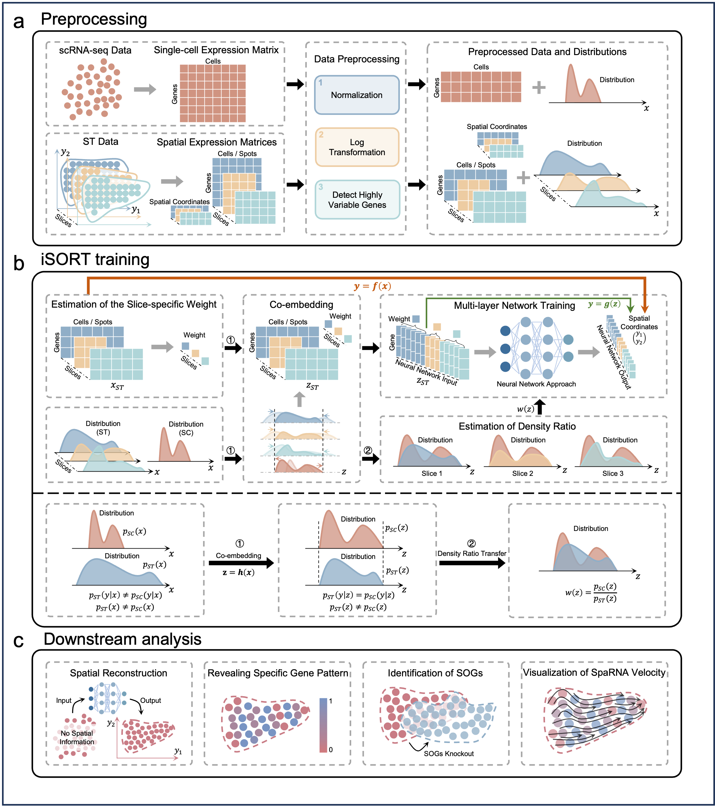

# iSORT
## Transfer learning of multicellular organization via single-cell and spatial transcriptomics
iSORT is an computational tool to integrate scRNA-seq data and spatial transcriptomics (ST) data. To integrate the biological heterogeneity among different samples, iSORT, using transfer learning and leveraging multiple Spatial Transcriptomics (ST) slices, is capable of capturing individual specificity while enhancing the accuracy and robustness of predictions for the spatial locations of single-cell RNA sequencing (scRNA-seq) data. This method further aids in identifying Spatial-Organizing Genes (SOGs), offering insights for the diagnosis and treatment of critical genes associated with diseases. Furthermore, iSORT could visualize SpaRNA velocity on the read ST slice.

### Pipeline of iSORT



## Requirements and Installation
[](https://www.python.org/)
[](https://pypi.org/project/anndata/) 
[](https://pypi.org/project/cvxpy/)
[](https://pypi.org/project/matplotlib/)
[](https://pypi.org/project/matplotlib-inline/)
[](https://pypi.org/project/numpy/)
[](https://pypi.org/project/pandas/)
[](https://pypi.org/project/scanpy/)
[](https://pypi.org/project/scipy/)
[](https://pytorch.org/)
[](https://pytorch.org/)
[](https://pytorch.org/)


### Create and activate Python environment
It is recommended to create a virtual environment for using iSORT to avoid any conflicts with existing Python installations. You can create a virtual environment using Anaconda:
```bash
conda create -n iSORT-env python=3.8 
conda activate iSORT-env
```


### Install PyTorch

PyTorch installation depends on your system's CUDA version to enable GPU support. You should visit the [PyTorch official website](https://pytorch.org/get-started/locally/) to find the appropriate installation command based on your system configuration (operating system, CUDA version, etc.).

For example, the installation command for a system with CUDA 11.8 might look like this (you should use the command specific to your system setup):

```bash
conda install pytorch torchvision torchaudio pytorch-cuda=11.8 -c pytorch -c nvidia
```
Note: This is just an example. Please refer to the PyTorch website for the command that matches your system's specific requirements.


### Install Other Packages

After installing PyTorch, you can install the remaining dependencies for iSORT from the provided `requirements.txt` file. This file lists all the necessary Python packages and their versions to ensure compatibility and smooth operation of iSORT.

To install these dependencies, run the following command:

```bash
pip install -r requirements.txt
```

This will automatically install all the packages listed in the `requirements.txt` file with the specified versions.

Note: Make sure that you have activated the virtual environment (`iSORT-env` if you followed the earlier steps) before running this command. Also, since PyTorch has already been installed separately to match your system's CUDA version, ensure that PyTorch is not listed in the `requirements.txt` to avoid version conflicts.

### Install iSORT

To install iSORT, simply use pip with the following command:

```bash
pip install isortpy
```

This command will download and install the iSORT package from PyPI, making it ready to use in your Python environment.

### Tutorial of iSORT
For the tutorial, you can download the necessary data from [this link](https://drive.google.com/drive/folders/1XhvFyLK0-T6aSuIXONDyS16FwIHYa4Al?usp=drive_link). 

